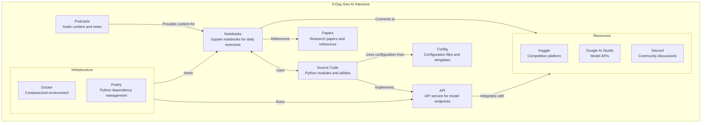

# Replace PlantUML with Mermaid

## Problem Statement
The repository currently uses PlantUML for diagrams, which has several issues:

1. PlantUML requires Java and GraphViz, which may not be available or optimized on FreeBSD
2. Mermaid is directly supported in GitHub markdown and Org-mode
3. PlantUML requires additional tooling that may not be available across all platforms
4. Several files reference PlantUML in scripts and documentation

## Affected Files

The following files use or reference PlantUML:
- `README.org` (contains PlantUML diagrams)
- `project_structure.org` (contains PlantUML diagrams)
- `CHECKLIST.org` (references PlantUML)
- `scripts/setup-emacs-env.sh` (installs PlantUML)

## Proposed Solution

1. Convert all PlantUML diagrams to Mermaid syntax
2. Update references to PlantUML in documentation and scripts
3. Remove PlantUML dependencies from setup scripts
4. Update the `CHECKLIST.org` to reference Mermaid instead of PlantUML
5. Update CI/CD to leverage GitHub's native Mermaid support

## Implementation Plan

1. Create Mermaid versions of all existing diagrams
2. Update org files to use Mermaid code blocks
3. Update setup scripts to remove PlantUML dependencies
4. Update documentation to reference Mermaid instead of PlantUML
5. Test rendering on GitHub and in local Emacs environment

## Examples of Mermaid Equivalent

Current PlantUML diagram:
```plantuml
@startuml
!include https://raw.githubusercontent.com/plantuml-stdlib/C4-PlantUML/master/C4_Context.puml
...
@enduml
```

Equivalent in Mermaid:


## Benefits

1. Better compatibility with FreeBSD and other platforms
2. Native rendering in GitHub without additional tools
3. Simpler setup and fewer dependencies
4. More modern and widely supported diagram format